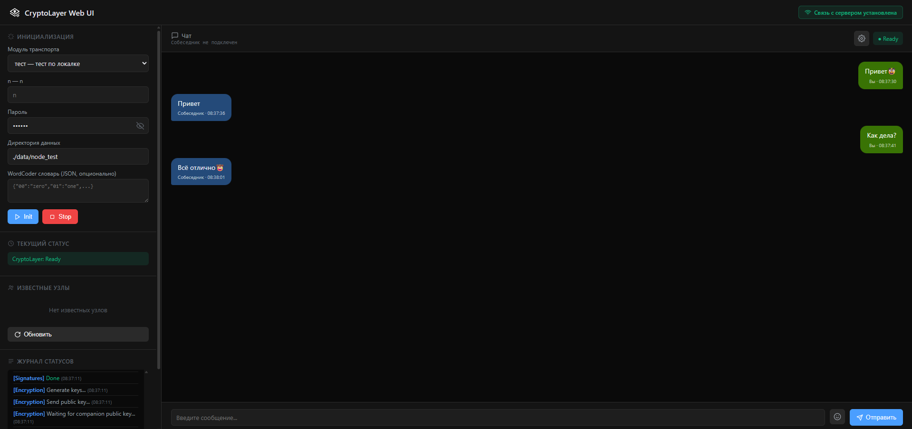
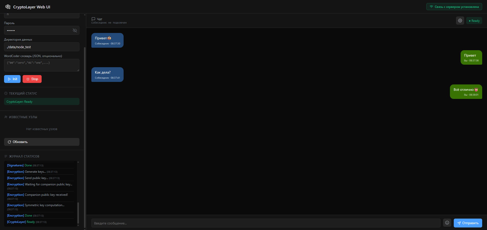

<div align="center">

# CryptoLayer Web UI


Web-интерфейс для защищенного обмена сообщениями в мессенджерах на базе CryptoLayer.

[](LICENSE)
[](https://www.python.org/)


---

 

</div>

## Запуск:

### Docker

```shell

git submodule update --init --recursive

sudo docker build -t cryptolayer-web-ui .

sudo docker run -d -p 8000:8000 cryptolayer-web-ui

```

### Или на хосте

```shell

git submodule update --init --recursive

python3 -m venv venv

source venv/bin/activate

python3 modules/generate_reqs.py

pip install -r modules/common_requirements.txt

pip install -r requirements.txt

python3 modules/generate_hidden_imports.py

uvicorn main:app --host 0.0.0.0 --port 8000

```

После запуска открыть в браузере http://127.0.0.1:8000/

## Ссылки

<a id="crypto-ref"></a>1 - CryptoLayer: https://github.com/igmunv/cryptolayer </a>

<a id="modules-ref"></a>2 - Модули: https://github.com/igmunv/cryptolayer-modules </a>
