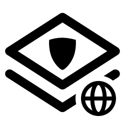

<div align="center">

# CryptoLayer Web UI




Web-интерфейс для защищенного обмена сообщениями в мессенджерах на базе CryptoLayer.

[](LICENSE)
[](https://www.python.org/)

</div>

---

## Запуск:
```shell
uvicorn main:app --host 127.0.0.1 --port 8000
```
- открыть в браузере http://127.0.0.1:8000/

**Важно:** *перед этим нужно закинуть в папку с этим web ui файлы cryptolayer<sup>[1](#crypto-ref)</sup> и папку с модулем<sup>[2](#modules-ref)</sup> в папку modules*


## Ссылки

<a id="crypto-ref"></a>1 - CryptoLayer: https://github.com/igmunv/cryptolayer </a>

<a id="modules-ref"></a>2 - Модули: https://github.com/igmunv/cryptolayer-modules </a>